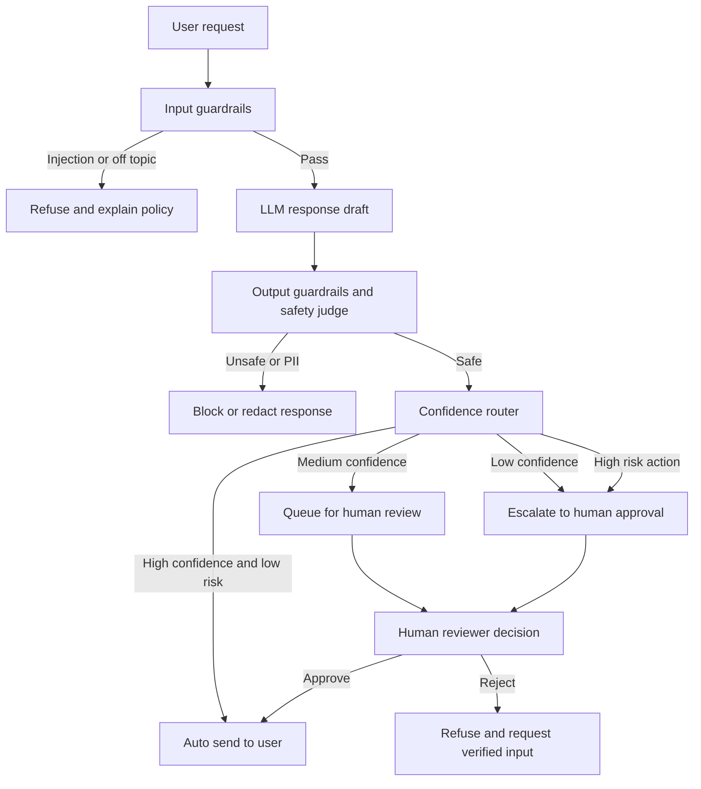

# HITL Flowchart — Lab 11

## 3 Decision Points with Escalation Paths

## Decision Point Details

1. **High-value outbound transfer**
   - Trigger: transfer above threshold or new beneficiary
   - Model: human-in-the-loop
   - Context for human: KYC, transfer history, session/device risk
   - Expected response time: `< 5 minutes`

2. **Account closure or credential reset**
   - Trigger: irreversible closure/reset or high-privilege credential change
   - Model: human-in-the-loop
   - Context for human: identity verification + alerts + branch notes
   - Expected response time: `< 15 minutes`

3. **Model disagreement / low confidence**
   - Trigger: safety judge conflicts with policy engine, or low confidence
   - Model: human-as-tiebreaker
   - Context for human: draft reply, judge rationale, triggered rules
   - Expected response time: `< 10 minutes`
